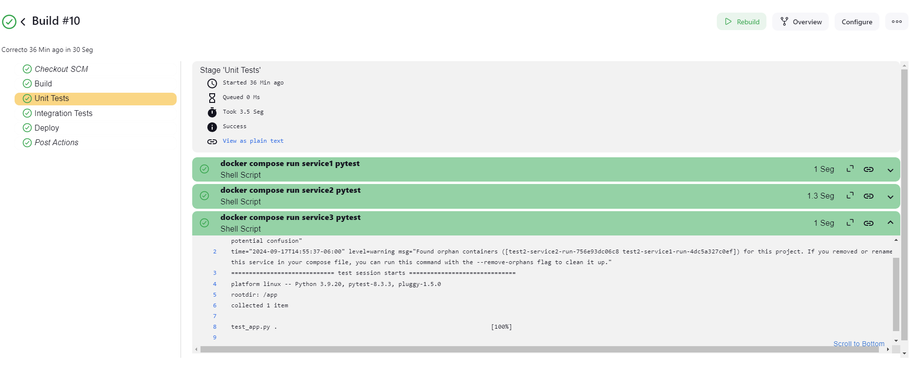

# Microservices CD Orchestrator

## Overview

This project demonstrates a basic microservices architecture with an automated deployment pipeline. It consists of three small services containerized with Docker and orchestrated through a Jenkins pipeline.

## Project Structure

- `service1`, `service2`, `service3`: Flask-based microservices
- `docker-compose.yml`: Defines the multi-container Docker application
- `Jenkinsfile`: Configures the CI/CD pipeline

## Pipeline Workflow

1. Build Docker images
2. Run unit tests for each service
3. Perform integration tests
4. Deploy

## Getting Started

1. Ensure Docker and Jenkins are installed on your system
2. Clone this repository
3. Set up a Jenkins job using the provided `Jenkinsfile`
4. Run the pipeline to build, test, and deploy the services

## Jenkins Pipeline Visualization

